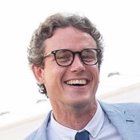

## Benjamin Burton Mathematician and Software Developer

I am a half-mathematician, half-computer scientist based in Brisbane, Australia.
I have worked in computational geometry, information security,
financial mathematics, and gifted-and-talented education.

I do software development and research consulting as a sole trader
(ABN: 52987060341). For further details, you can
[contact me at bab@benburton.org](mailto:bab@benburton.org).

Some of the projects I am currently involved in:

- **International Olympiad in Informatics**

  I am currently serving as President of the
  [The International Olympiad in Informatics (IOI)](http://www.ioinformatics.org/),
  the premier competition for programing and algorithm design for secondary school students.
  I spent 10 years as a delegation leader and coach of the Australian team,
  and since 2008 I have been working behind the scenes with the different committees that
  oversee the IOI.

  IOI 2024 will be in [Alexandria, Egypt](https://www.ioi2024.eg) this September,
  and in 2013 we hosted [IOI 2013 in Brisbane, Australia](http://www.ioi2013.org/)!

- **National Mathematics Summer School**

  [The National Mathematics Summer School (NMSS)](https://nmss.edu.au/) gives
  talented and enthusiastic secondary students a taste of research, and a feel for
  what _doing_ mathematics is really like. I was involved as a tutor and lecturer
  for ~25 years, and served as Director of NMSS between 2018--2020.

- **Software Development**

  My largest and oldest software project is _Regina_, an open-source
  software package for low-dimensional topologists. You can find _Regina_ at
  [regina-normal.github.io](http://regina-normal.github.io/).

  I have a number of iPhone, iPad and Apple Watch apps, including:
  - [References](references/), to browse through your BibTeX databases;
  - [Modular Arithmetic](modular-arithmetic/), to do arithmetic modulo _N_;
  - [PDF Projector](https://sites.google.com/site/appsformaths/pdf-projector/),
    to project your PDF slideshows onto an external screen;
  - [Inkpad Libre](https://github.com/baburton/inkpad/),
    which is the open-source continuation of Steve Sprang's excellent vector graphics app for the iPad.

- **Research Consulting**

  I help various organisations with scientific research consulting.
  If you are interested in talking further about this, please
  [contact me at bab@benburton.org](mailto:bab@benburton.org).

I also work as a mathematician at The University of Queensland.
For more on my academic work, see
[my main university website](http://www.maths.uq.edu.au/~bab) at UQ.
