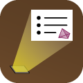

## PDF Projector 

An iPhone / iPad app for projecting PDF slideshows onto an external screen. If
you have an Apple Watch, you can also use it as a remote control.

This app is useful if you write presentations using LaTeX Beamer, or
LibreOffice Impress, or some other application that exports to PDF.

Simply open your PDF in the app and connect an external display (e.g., via
VGA, HDMI, or AirPlay). Your slides will be displayed full-screen on the
external display, while the app provides additional navigation controls on
your iPad or iPhone.

For details and screenshots, see the
[App Store](https://apps.apple.com/au/app/pdf-projector/id1444555016).

For support or suggestions, contact the author at bab at benburton.org.

**Who wrote this?**

Benjamin Burton.  By day I do research in computational geometry and topology
at The University of Queensland
(see [my university site](http://www.maths.uq.edu.au/~bab)),
and a lot of my work involves writing mathematical software.
I do iOS programming in my spare time.

**Why this app?**

This was something I wanted myself - as a mathematician, I often give lectures
and seminars using PDF slides created in LaTeX Beamer, and it is nice to bring
just an iPad or iPhone to lectures instead of my entire laptop.

**Examples**

If you want to experiment with the app, you can download some example PDF
presentations:

- [ioi.pdf](ioi.pdf) (11 pages)
- [polytopes.pdf](polytopes.pdf) (22 pages)

**Privacy policy**

This app does not collect any data.

Enjoy!
